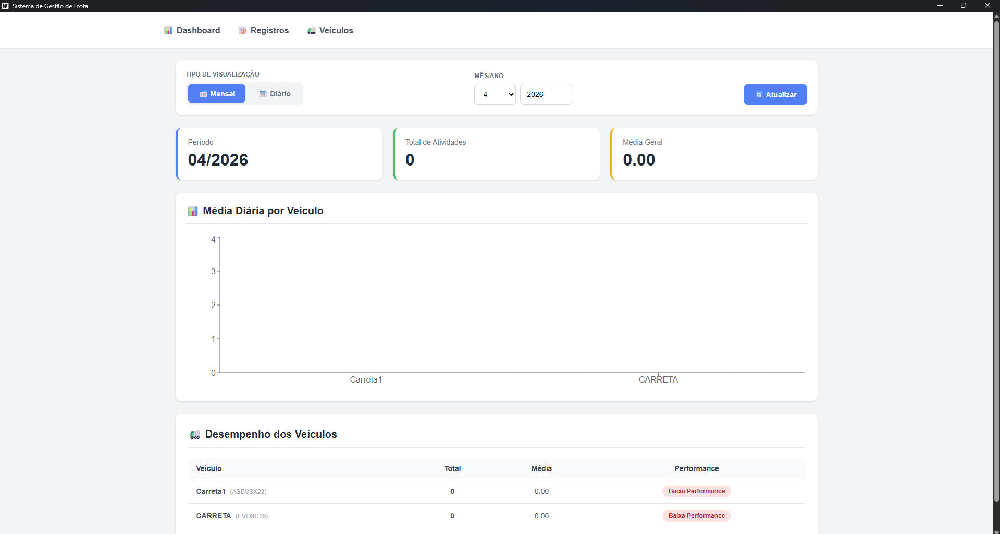
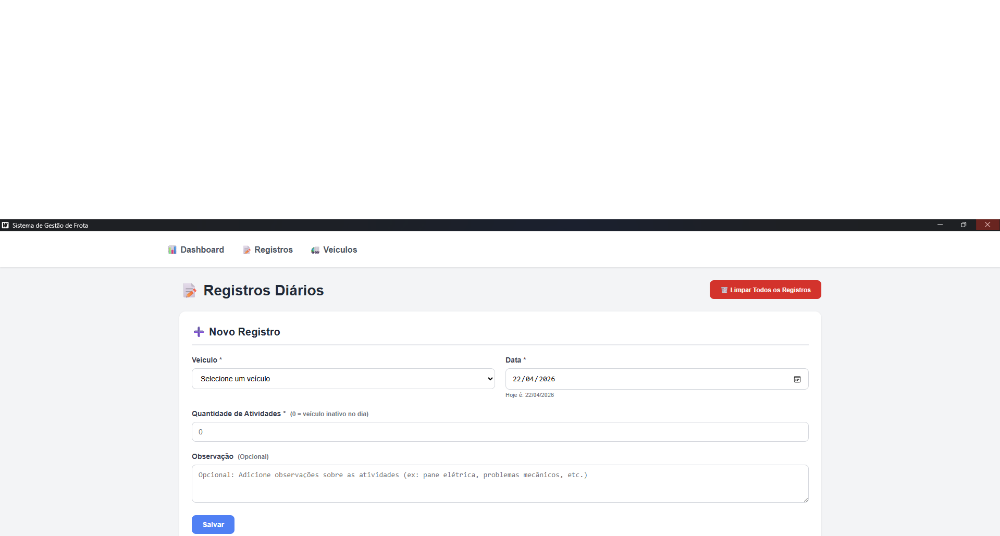

# 🚛 Sistema de Gestão de Frota

Sistema desktop para gerenciamento de frota de veículos, controle de atividades diárias e análise de performance.


## 📋 Sobre o Projeto

O **Sistema de Gestão de Frota** foi desenvolvido para empresas que precisam controlar as atividades diárias de seus veículos, monitorar a performance da frota e gerar relatórios de produtividade.

### Funcionalidades Principais

- ✅ **Cadastro de Veículos** - Gerencie todos os veículos da frota com nome, placa e categoria
- ✅ **Registro de Atividades** - Lance as atividades diárias de cada veículo
- ✅ **Dashboard Interativo** - Visualize gráficos e estatísticas de performance
- ✅ **Categorias de Performance** - Configure limites personalizados por tipo de veículo
- ✅ **Filtros por Data** - Consulte registros por período específico
- ✅ **Observações Obrigatórias** - Campo de observação obrigatório para dias sem atividades

### Tecnologias Utilizadas

| Tecnologia | Descrição |
|------------|-----------|
| **Go** | Backend e lógica de negócio |
| **Wails** | Framework para aplicações desktop |
| **React + TypeScript** | Frontend com tipagem estática |
| **SQLite** | Banco de dados local (sem necessidade de instalação) |
| **Recharts** | Gráficos interativos |

## 📸 Screenshots

### Dashboard


### Registros Diários


### Gerenciar Veículos


## 🚀 Como Executar

### Para usuários finais (clientes)

1. Baixe o arquivo `SistemaFrota_Setup.exe`
2. Execute o instalador e siga as instruções
3. Após a instalação, clique no ícone da Área de Trabalho
4. O programa abrirá e você pode começar a usar!

**⚠️ Requisitos:** Windows 10 ou superior (WebView2 já incluso no sistema)

### Para desenvolvedores

#### Pré-requisitos

- [Go 1.21+](https://go.dev/dl/)
- [Node.js 18+](https://nodejs.org/)
- [Wails CLI](https://wails.io/docs/gettingstarted/installation)

#### Clonar e executar

```bash
git clone https://github.com/MaiconDAS/sistema-frota.git
cd sistema-frota
wails dev